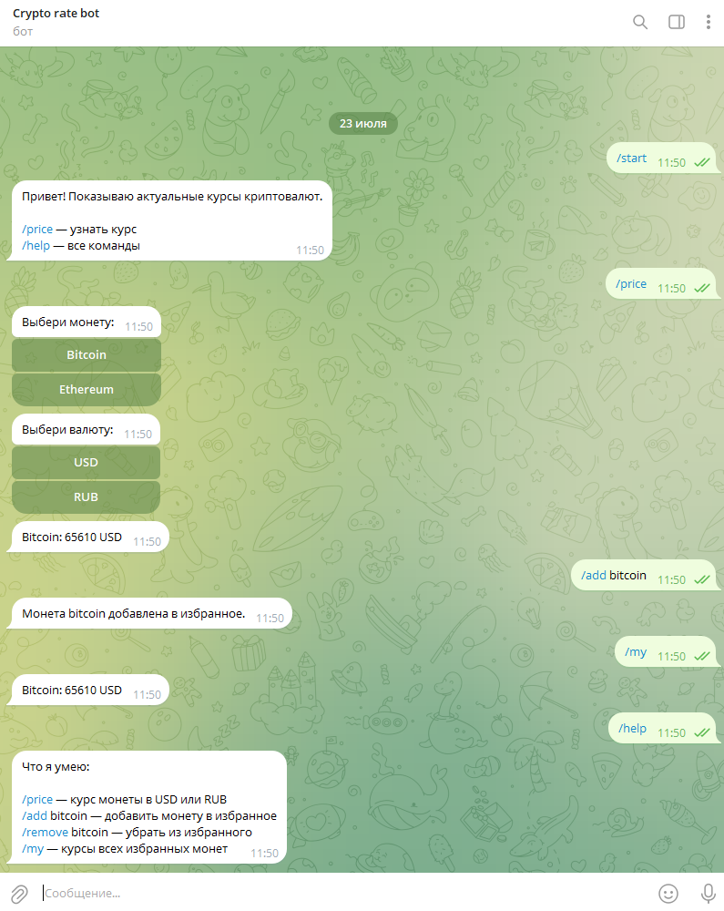

# Крипто-бот

Telegram-бот для получения актуальных курсов криптовалют.
Позволяет выбрать монету и валюту через интерактивные кнопки
и получить текущую цену. Данные берутся из CoinGecko API.

## Скриншот

## Возможности

- Просмотр актуального курса криптовалют (Bitcoin, Ethereum)
- Выбор валюты отображения: USD или RUB
- Интерактивные inline-кнопки вместо ручного ввода команд
- Обработка сетевых ошибок: при недоступности API бот сообщает об этом и продолжает работу

## Команды

- `/start` — приветствие и краткая информация
- `/help` — справка по возможностям
- `/price` — выбор монеты и валюты, вывод курса

## Стек

- Python 3.12
- aiogram — работа с Telegram Bot API
- requests — запросы к CoinGecko API

## Запуск

1. Клонировать репозиторий
2. Создать виртуальное окружение и активировать его
3. Установить зависимости: `pip install -r requirements.txt`
4. Создать файл `.env` и добавить токен: `BOT_TOKEN=ваш_токен`
5. Запустить: `python bot.py`